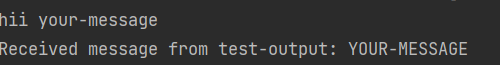

### How to Start the Application

#### Prerequisites

- Java 17+ installed
- Maven installed
- Docker & Docker Compose installed

##### Start Kafka and Zookeeper using Docker Compose:

1. Start the docker engine in your system.
2. Open a terminal in the project root (where docker-compose.yml is located):
3. Run the following command to start Kafka and Zookeeper:

```bash 
docker-compose up -d
```
4. Wait until all containers are running.
5. Start the Application 

##### Produce to input topic:

1. Open a terminal and run the following command to produce messages to the input topic:

```bash
docker exec -it kafka-broker bash
echo "your-message" | kafka-console-producer --broker-list localhost:9092 --topic test-input
exit
```
2. Replace "your-message" with the message you want to send.
3. You should see the processed message in the application log.

